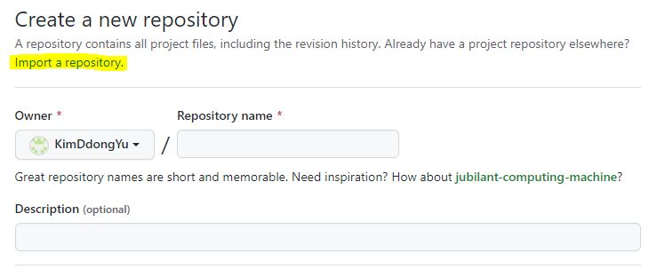
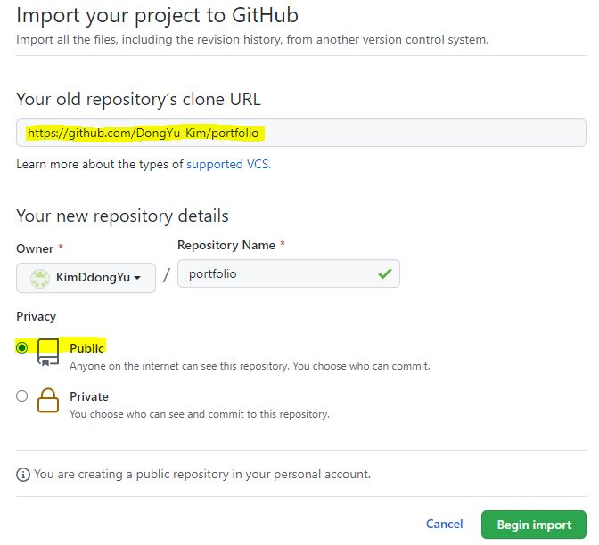
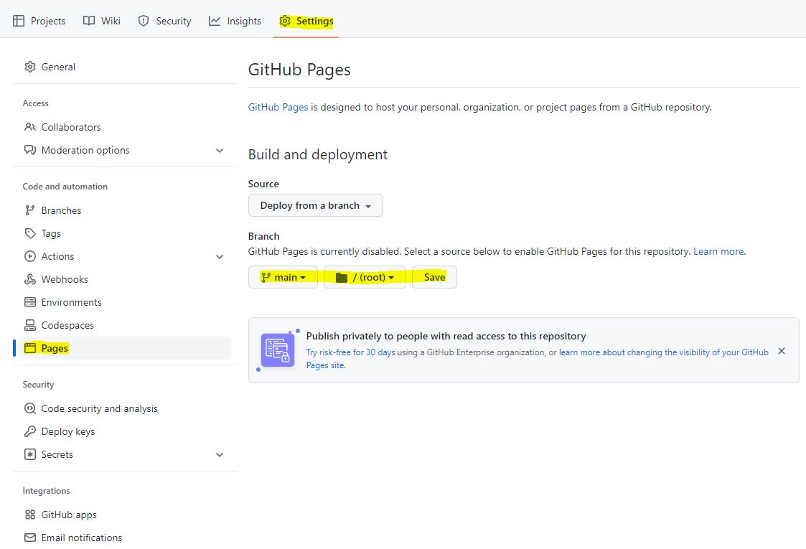

# 떵유's Portfolio made with React
github.io에 포트폴리오 웹페이지를 만드는데 사용할 수 있습니다.   
clone 받고, 마음껏 수정하고 사용하셔도 됩니다.   
[GitHub Repository](https://github.com/DongYu-Kim/portfolio) | [Portfolio WebPage](https://dongyu-kim.github.io/portfolio/)   
## 사용 방법, 클론 하기
GitHub에서 레포지토리를 만들 때, import a repository를 클릭합니다.


URL에 https://github.com/DongYu-Kim/portfolio를 입력하고,   
Repository Name을 설정하고, Public을 체크한 후 import를 합니다.


Settings -> Pages 에 들어가서   
GitHub Pages의 Branch 설정을 하고 Save합니다.


시간이 지나면, guthub.io(닉네임.github.io/레포지토리이름)에 
포트폴리오 웹페이지가 나옵니다.

## 사용 방법, 커스텀 하기

소스코드 다운로드
```bash
git clone {URL}

cd portfolio
npm install
```

소스코드 테스트
```bash
npm run start
```

소스코드 빌드
```bash
npm run build
```
package.json에 기본적으로 설정을 해놨기에, 빌드하고 git에 올리(push)면 됩니다.
